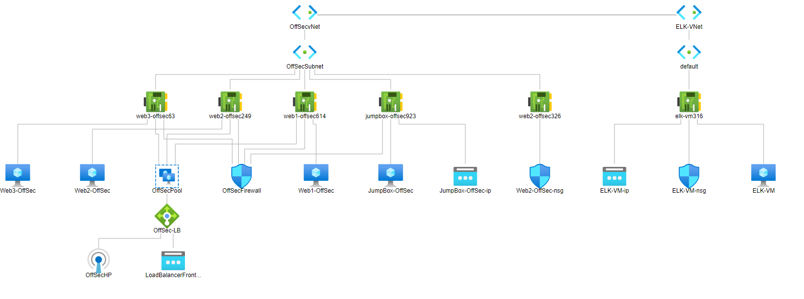
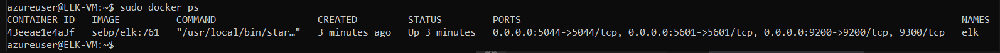

## Automated ELK Stack Deployment

The files in this repository were used to configure the network depicted below.

These files have been tested and used to generate a live ELK deployment on Azure. They can be used to either recreate the entire deployment pictured above. Alternatively, select portions of the _____ file may be used to install only certain pieces of it, such as Filebeat.

  - _TODO: Enter the playbook file._

This document contains the following details:
- Description of the Topology
- Access Policies
- ELK Configuration
  - Beats in Use
  - Machines Being Monitored
- How to Use the Ansible Build

### Description of the Topology

The main purpose of this network is to expose a load-balanced and monitored instance of DVWA, the D*mn Vulnerable Web Application.

Load balancing ensures that the application will be highly reliable, in addition to restricting traffic to the network.
- Load balancers protect the accessibility of the DVWA instance by limiting the traffic that can go to any one server at a time. The jump box allows access into the web servers that are running the application from a separate security zone to manage the devices that the servers are running from. 

Integrating an ELK server allows users to easily monitor the vulnerable VMs for changes to the applications and system logs.
- Filebeat records logs from specified locations on the server.
- Metricbeat records the metrics of the operating system that the servers run on to be monitored over time.

The configuration details of each machine may be found below.
_Note: Use the [Markdown Table Generator](http://www.tablesgenerator.com/markdown_tables) to add/remove values from the table_.

| Name     | Function | IP Address | Operating System |
|----------|----------|------------|------------------|
| Jump Box | Gateway  | 10.1.0.4   | Linux            |
| Web1     | Server   | 10.1.0.5   | Linux            |
| Web2     | Server   | 10.1.0.8   | Linux            |
| Web3     | Server   | 10.1.07    | Linux            |

### Access Policies

The machines on the internal network are not exposed to the public Internet. 

Only the ELK machine can accept connections from the Internet. Access to this machine is only allowed from the following IP addresses:
- 24.30.114.63

Machines within the network can only be accessed by the Jump Box.
- The Jump Box is the only machine that can access the ELK VM. The IP of the Jump Box is 10.1.0.4.

A summary of the access policies in place can be found in the table below.

| Name          | Publicly Accessible | Allowed IP Addresses |
|---------------|---------------------|----------------------|
| Jump Box      | No                  | 24.30.114.63         |
| Load Balancer | Yes                 | Any                  |
| ELK VM        | No                  | 10.1.0.4             |

### Elk Configuration

Ansible was used to automate configuration of the ELK machine. No configuration was performed manually, which is advantageous because it allows new machines to be added in and configured easily by adding in the new private IP of the machine to the "hosts" file and running the playbook. 

The playbook implements the following tasks:
- Install docker.io: This task installs the docker package for Linux based OS's onto the ELK server VM.
- Install python3-pip: This installs python3 to the ELK server machine so it won't run the default python2.
- Install Docker Module: This installs the Docker Module onto the ELK machine using python3. 
- Increase VM Memory: Since Docker needs more RAM to run properly, this task increases the amount of memory that the ELK machine can use, given that the machine has enough RAM to support it. 
- Download and Launch Docker Container: This downloads and launches the Docker Container onto the ELK server using the sebp/elk:761 image. 

The following screenshot displays the result of running `docker ps` after successfully configuring the ELK instance.

### Target Machines & Beats
This ELK server is configured to monitor the following machines:
- 10.1.0.5
- 10.1.0.8
- 10.1.0.7

We have installed the following Beats on these machines:
- Filebeat
- Metricbeat

These Beats allow us to collect the following information from each machine:
- _TODO: In 1-2 sentences, explain what kind of data each beat collects, and provide 1 example of what you expect to see. E.g., `Winlogbeat` collects Windows logs, which we use to track user logon events, etc._

### Using the Playbook
In order to use the playbook, you will need to have an Ansible control node already configured. Assuming you have such a control node provisioned: 

SSH into the control node and follow the steps below:
- Copy the config file to the ansible container on the ELK machine.
- Update the hosts file in the ansible container to include the private IP's of the Web VM's under the "[webserver]" heading to indicate the machines that should recieve the files and settings in the Filbeat or Metricbeat playbooks. Under the "[ELK]" heading in the same hosts file, add the private IP of the ELK machine to specify that this machine recieves the ELK settings and files. Make sure to include "ansible_python_interpreter=/usr/bin/python3" after each of the private IP's so that Docker will run using python3 instead of python2. 
- Run the playbook, and navigate to the public IP of the ELK machine using port 5601 (ie 40.84.135.62:5601) in a browswer to check that the installation worked as expected.

_As a **Bonus**, provide the specific commands the user will need to run to download the playbook, update the files, etc._
